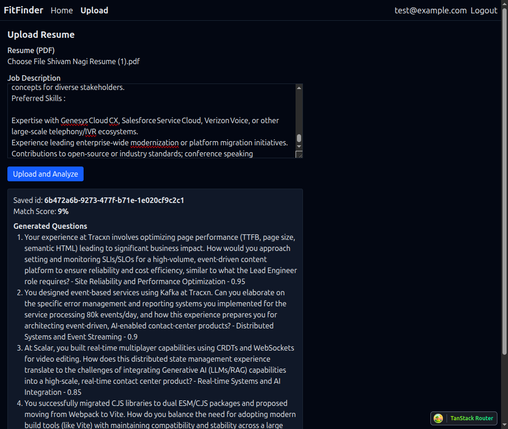

# FitFinder

FitFinder helps you screen resumes, score candidate-job fit, and automatically generate short interview questions based on the candidate's resume and a job description.



## Getting Started

1. Setup a `.env` file based on `.env.sample` and add your Gemini API key.

2. From your terminal:
   ```sh
   pnpm install
   pnpm dev
   ```

This starts the app in development mode, rebuilding assets on file changes.

## Features

- Upload resume PDFs and a job description
- Compute a simple match score between resume content and job description
- Generate initial screening questions using Gemini
- Built with TanStack Start
