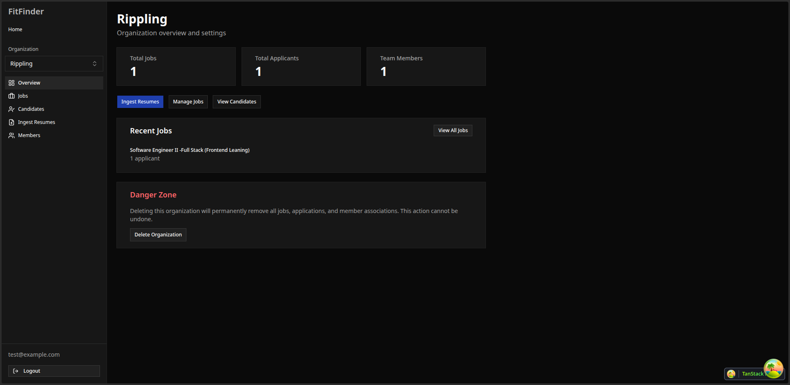
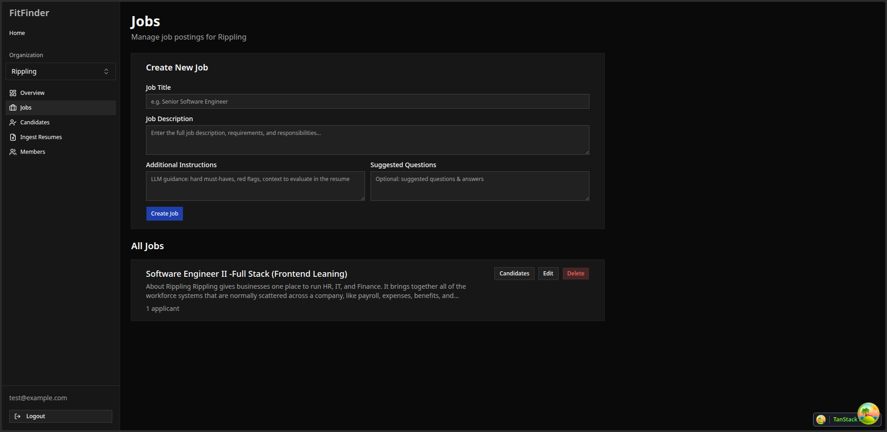
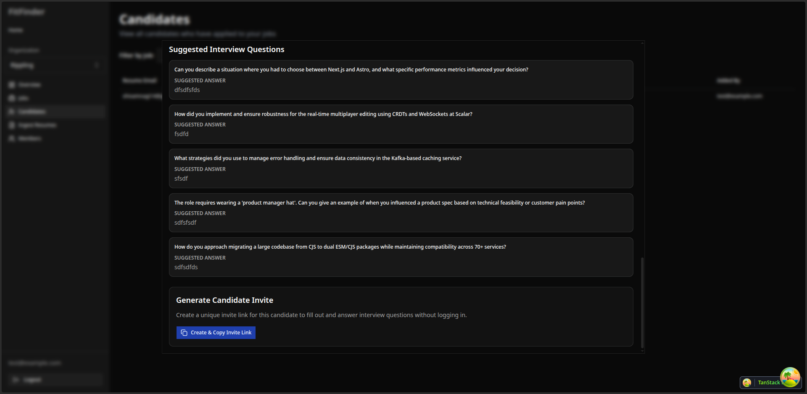
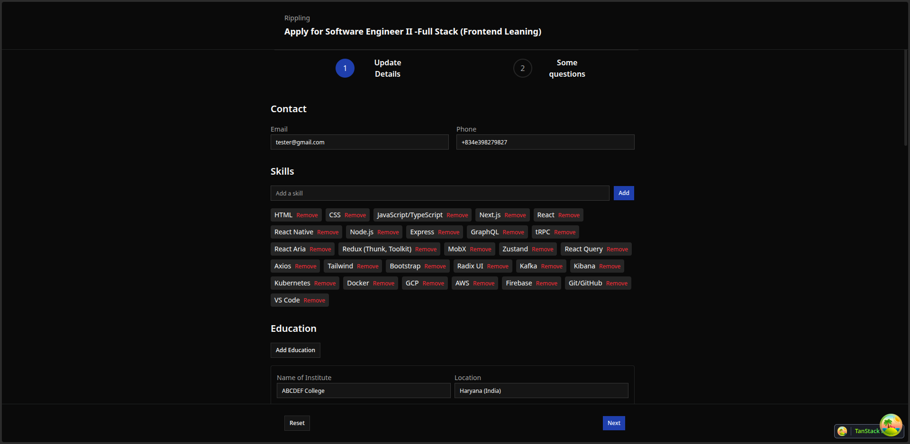
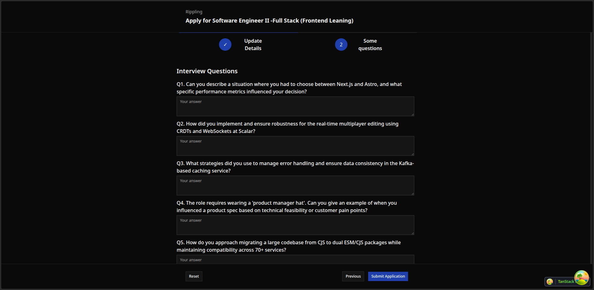

# FitFinder

FitFinder helps you screen resumes, score how well candidates match your job descriptions, and automatically generate interview questions using Google's Gemini AI.

## Getting Started

1. Create a `.env` file based on `.env.sample`
   - Add your Gemini API key
   - Add your postgres database url

2. Run:
   ```sh
   pnpm install
   pnpm dev
   ```

3. For production build we have nitro configured
   ```sh
   pnpm build
   ```

4. To start the app in production
   ```sh
   pnpm start
   ```

> I am deploying on vercel and have neon.tech as db, with migrations handled manually.

## Features

### Multi-Organization Management

You can manage multiple organizations, each with their own team members, jobs, and candidates. Useful if you're handling hiring for different companies or departments.



- Create and switch between organizations
- Add team members with admin roles
- See stats at a glance: total jobs, applicants, and team size
- Each organization's data is completely separate

### Job Management

Create job postings with all the details the AI needs to evaluate candidates properly.



- Add job titles and full descriptions
- Additional Instructions: Tell the AI what to look for (must-haves, red flags, specific experience)
- Suggested Questions: Pre-write questions you want asked during interviews
- See how many applicants each job has
- Edit or delete jobs (with confirmation to prevent accidents)

### AI-Powered Candidate Scoring

When you upload a resume, it gets analyzed against the job description and scored from 0-100. The AI also explains why it gave that score.

The system automatically pulls out structured data from resumes:
- Education: degrees, schools, dates, GPA
- Work experience: companies, roles, dates, job summaries
- Projects: descriptions, links, tech used
- Skills: normalized into a searchable database
- Contact info: email, phone, location
- Total experience calculated in months

### Candidate Management

View all your candidates in one place with filtering and sorting options.



- Filter by job or sort by match score
- Show or hide columns to focus on what matters
- Click any candidate to see their full details:
  - Complete resume data (education, experience, projects, skills)
  - Match score and the AI's reasoning
  - Contact information
  - When they applied
  - Interview questions generated for them

### Candidate Application Flow

Instead of making candidates sign up, you can send them invite links. They can fill out their details and answer interview questions without creating an account.





- Generate unique invite links for each candidate
- Two-step process: first they confirm/edit their details, then they answer questions
- Their resume data is pre-filled from the PDF you uploaded
- Easy forms for adding education, experience, and projects
- Skills can be added or removed
- Questions are tailored to their background and the job

### AI-Generated Interview Questions

For each candidate, the system generates interview questions based on their resume and the job description. You can also provide your own questions when creating the job, and the AI will incorporate those.

- Questions are specific to each candidate's experience
- Takes into account any custom instructions or questions you added to the job
- Questions are saved with each candidate for easy reference
- Candidates can answer them through the invite link

### Resume Ingestion

Upload resume PDFs and the system extracts the text, analyzes it, and stores everything in a structured format.

- Upload PDFs and extract text automatically
- Resumes are analyzed against job descriptions immediately
- Can process multiple resumes
- Everything is stored and organized by organization and job

## Architecture

- Frontend: TanStack Start with React
- Backend: Server functions handle data processing and AI calls
- Database: PostgreSQL with Prisma ORM, supports multi-tenancy
- AI: Google Gemini API for resume analysis and question generation
- Data layer: TanStack Query with tRPC for type-safe API calls
- Auth: Email/password with PBKDF2 hashing, sessions stored in encrypted cookies
